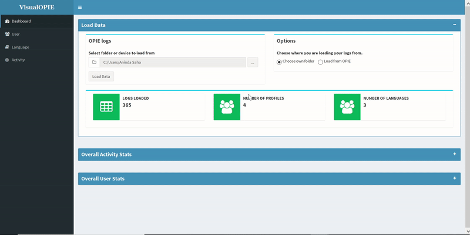

# VisualOPIE
## Winter Research 2018
## Data Visualisation Project

VisualOPIE was designed to leverage the logging capabilities of OPIE to provide a human-friendly visualisation of data. In turn, this visualisation will assist teachers, linguists, and engineers, in identifying where OPIE is effective and where OPIE could be improved.

VisualOPIE is a dashboard visualising data that is:
* User-centric (e.g., how well is a particular person doing with learning words?)
* Language-centric (e.g., which languages are being utilised, how easy or difficult are certain words?)
* Activity-centric (e.g., which activities are being used, how long, and which activities are performing as expected?)

VisualOPIE is part of the Indigenous Langauge Robot eco-system, initially developed for the OPIE version!

## Developers
Aninda Saha (a.saha@uq.net.au), James Nguyen (j.nguyen@uq.net.au)

## Usage
### User Guides
[User Guides](docs/README.md) : For general guides on how to use VisualOPIE.

### Installation
In the R console:

```r
install.packages("devtools") # If not already installed.
devtools::install_github("CoEDL/visualopie")
```

Installation will also install package dependencies detailed in the 'Tech Stack' section.

### Run app
```r
library(visualopie)
run_visualopie()
```

## Tech Stack
R with the following required packages:
* [Shiny](https://shiny.rstudio.com/)
* [Shiny Dashboard](https://rstudio.github.io/shinydashboard/)
* [Tidyverse](https://www.tidyverse.org/)
* [data.table](https://cran.r-project.org/package=data.table)
* [DT](https://rstudio.github.io/DT/)

Packages can be installed manually in R or the R Studio console with install.packages('PackageName'), e.g., install.packages('tidyverse').

If necessary you can download and install R [here](https://www.r-project.org/), and R Studio [here](https://www.rstudio.com/).

## Third Party Widgets (Included)
[Shiny Directory Input](https://github.com/wleepang/shiny-directory-input)<br />
License: BSD 3-Clause License ([View](widgets/shiny-directory-input/LICENSEN))<br />
Author: W. Lee Pang, PhD

## Screenshots


## Issues to be fixed in upcoming patch
* Windows has problems detecting Android Tablet due to security issues. Windows will still be able to load logs from USB or from computer.
