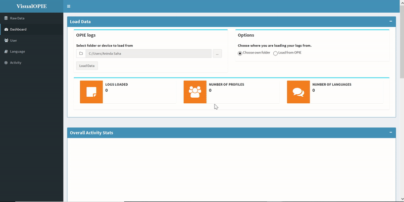
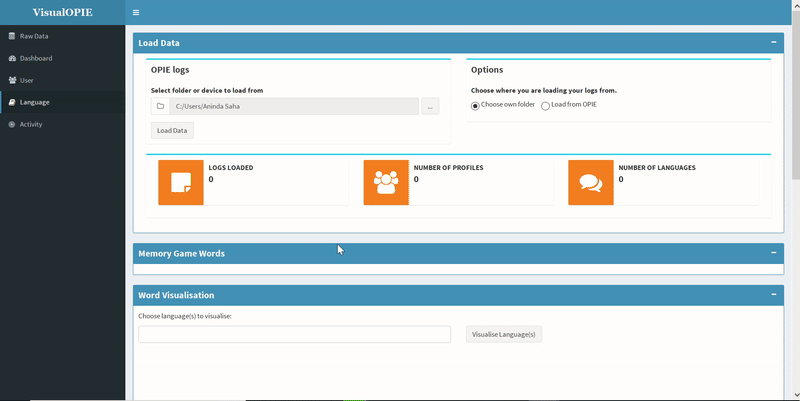
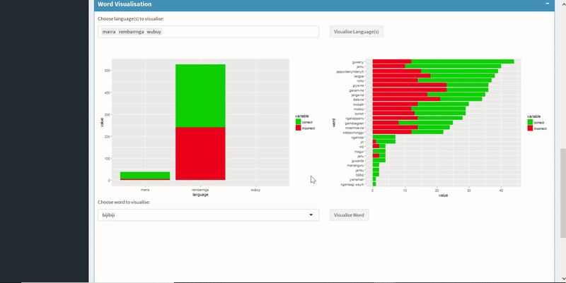

# Using VisualOPIE
Author(s): Aninda Saha (a.saha@uq.net.au), James Nguyen (j.nguyen@uq.net.au)

## Navigating VisualOPIE

Welcome to VisualOPIE! We aim to provide the best possible user interaction with our data visualisation tool and provide a comprehensive understanding about the performance of students using our social robots.

* Our app features 4 different tabs: Dashboard, User, Language and Activity. The navigation panel for these tabs can be found on the left hand side of the screen.  
* The dashboard presents a summary of interactions including the duration spent per activity as well as with per language.  
* The user page provides individual performance statistics that can be used by teachers to focus more attention to students who are not performing well.  
* The language page provides language specific information, such as, which languages are being more interacted with and which are not.  
* The activity page focuses on the interaction and performance per activity.

<a name = "select">
## Selecting logs folder
<a/>

1. Click on the button labeled '...'  
2. A file browser window will now open. You now need to select where you want to load your log files from.
    - If loading from local folder, navigate and select the folder containing the logs.
    - If your usb drive has a subfolder containing the logs, please select this folder.
    - If your usb drive contains logs in main page, simply select the drive.   
3. Click OK and the file browser will close.  

## Loading logs from your computer

1. In the 'Load Data' box at the top of the app, ensure 'Choose your own folder' is selected in the Options section.  
2. [Select](#select) the folder you want to load from.  
3. Back in VisualOPIE, click on the Load Data button.  
4. VisualOPIE will automatically detect log files, notifications on the lower right will popup informing you of its progress.  
5. Your visualisation is ready!

## Loading logs from an external drive (e.g., USB Stick)

1. Insert your external drive into your computer, ensure it has been connected and appears as normal.  
2. [Select](#select) the folder/drive you want to load from.  
3. Back in VisualOPIE, click on the Load Data button.  
4. VisualOPIE will automatically detect log files, notifications on the lower right will popup informing you of its progress.  
5. Your visualisation is complete!

## Loading logs from OPIE
(Please note: There is currently a bug on Windows Machine preventing this functionality)

1. Plug OPIE's USB cable into your computer and ensure the android device appears.  
2. The tablet on OPIE's body will ask for instructions, set the tablet allow file transfer.  
3. In the 'Load Data' box at the top of the app, ensure 'Load from OPIE' is selected in the Options section.  
4. Under the OPIE Logs section, click on the button labeled '...'  
5. A file browser window will now open, select the android device representing OPIE.  
6. Click OK and the file browser will close.  
7. Back in VisualOPIE, click on the Load Data button.  
8. VisualOPIE will automatically detect log files, notifications on the lower right will popup informing you of its progress.  
9. Your visualisation is complete!

## Filtering visualisations
In order to customise the visualisation to display the desired information, VisualOPIE has been designed to be highly interactive. Some visualisations allow you to filter or specify which parts of the data you want to see, rather than all data. For example, in the language page you are able to specify languages of interest, or words of interest.

1. Clicking on the various tab options clearly allows visualisation of user-centric, language-centric and activity-centric data.   
2. Under the language tab, a dropdown menu will allow you to filter the specific language data that you would like to visualise.  
3. Further, you can also filter and visualise the specific words and the interaction summary with those words.  
4. Under the users tab, a dropdown menu will provide the opportunity to understand each individual's performance record.

